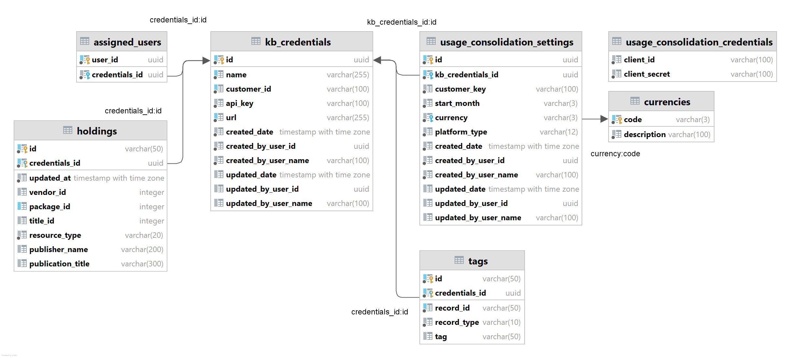

# mod-kb-ebsco-spring

Copyright (C) 2018-2022 The Open Library Foundation

This software is distributed under the terms of the Apache License,
Version 2.0. See the file "[LICENSE](LICENSE)" for more information.

* [Introduction](#introduction)
* [Compiling](#compiling)
* [Docker](#docker)
* [Installing the module](#installing-the-module)
* [Deploying the module](#deploying-the-module)
* [DB schema](#db-schema)

## Introduction
Broker communication with the EBSCO knowledge base (Java)

## Compiling

```
   mvn install
```

See that it says "BUILD SUCCESS" near the end.

## Docker

Build the docker container with:

```
   docker build -t mod-kb-ebsco-spring .
```

Test that it runs with:

```
   docker run -t -i -p 8081:8081 mod-kb-ebsco-spring
```

## Installing the module

Follow the guide of
[Deploying Modules](https://github.com/folio-org/okapi/blob/master/doc/guide.md#example-1-deploying-and-using-a-simple-module)
sections of the Okapi Guide and Reference, which describe the process in detail.

First of all you need a running Okapi instance.
(Note that [specifying](../README.md#setting-things-up) an explicit 'okapiurl' might be needed.)

```
   cd .../okapi
   java -jar okapi-core/target/okapi-core-fat.jar dev
```

We need to declare the module to Okapi:

```
curl -w '\n' -X POST -D -   \
   -H "Content-type: application/json"   \
   -d @target/ModuleDescriptor.json \
   http://localhost:9130/_/proxy/modules
```

That ModuleDescriptor tells Okapi what the module is called, what services it
provides, and how to deploy it.

## Deploying the module

Next we need to deploy the module. There is a deployment descriptor in
`target/DeploymentDescriptor.json`. It tells Okapi to start the module on 'localhost'.

Deploy it via Okapi discovery:

```
curl -w '\n' -D - -s \
  -X POST \
  -H "Content-type: application/json" \
  -d @target/DeploymentDescriptor.json  \
  http://localhost:9130/_/discovery/modules
```

Then we need to enable the module for the tenant:

```
curl -w '\n' -X POST -D -   \
    -H "Content-type: application/json"   \
    -d @target/TenantModuleDescriptor.json \
    http://localhost:9130/_/proxy/tenants/<tenant_name>/modules
```


### Issue tracker Trello

See project [Trello](https://trello.com/b/MyArr1mD/module-rewrite)

### TODO: Folio issue tracker
See project [MODKBEKBS](https://issues.folio.org/browse/MODKBEKBS)
at the [FOLIO issue tracker](https://dev.folio.org/guidelines/issue-tracker/).


## DB schema
This is the current DB structure, diagram link (to http://draw.io) will be added later


